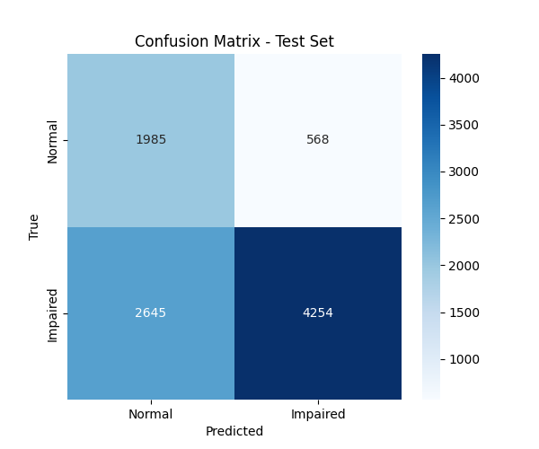

# Alzheimer's EEG Binary Classifier

## Clinical motivation
Early detection of Alzheimer's disease from EEG can enable low‑cost screening. This project classifies resting‑state EEG into **Normal** vs **Impaired** (MCI + Moderate/Severe) using deep learning.

## Dataset
- **Source**: OpenNeuro dataset DS007526 (88 subjects, 19‑channel EEG)
- **Preprocessing**: Bandpass (0.5‑45 Hz), notch (50 Hz), resample to 250 Hz, 2‑second epochs, z‑score normalisation.

## Models evaluated
| Model | Val Accuracy | Test Accuracy | Precision (Impaired) | Recall (Impaired) |
|-------|--------------|---------------|----------------------|--------------------|
| EEGNet (final) | **80.1%** | 72.2% | 0.81 | 0.80 |
| Transformer | 74.6% | 72.2% | 0.80 | 0.79 |
| EEG‑GAT | 67.9% | 72.9% | 0.76 | 0.92 |

The **EEGNet** model was selected for its balance of performance and simplicity.

## Repository structure
alzheimers-eeg-classifier/
├── src/ # core modules (models, training, utils)

├── experiments/ # configs and results per model

├── notebooks/ # exploration and final training notebook

├── scripts/ # command‑line runners (coming soon)

├── requirements.txt

└── README.md

## How to reproduce
1. Clone this repo.
2. Install dependencies: `pip install -r requirements.txt`
3. Download the dataset from OpenNeuro (DS007526) and place in `data/raw/`.
4. Run the preprocessing and training notebook (link to Kaggle notebook provided).

## Results
Confusion matrix for EEGNet on test set:

## License
MIT
